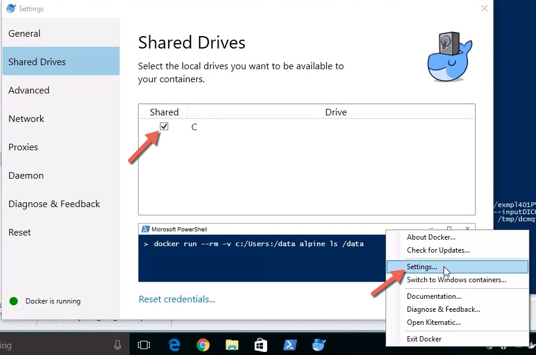

.. _radiomics-installation-label:

============
Installation
============

There are three ways you can use pyradiomics:
1. Install via pip
2. Install from source
3. Use 3D Slicer Radiomics extension
4. Use pyradiomics Docker

------------------
1. Install via pip
------------------

Pre-built binaries are available on PyPi for installation via pip. For the python versions
mentioned below, wheels are automatically generated for each release of PyRadiomics, allowing you to
install pyradiomics without having to compile anything. For other python versions, a source distribution
is also available, but this requires compiling the C extensions.

* Ensure that you have ``python`` installed on your machine, version 3.5, 3.6 or 3.7 (64-bits).

* Install PyRadiomics::

    python -m pip install pyradiomics

--------------------
2. Install via conda
--------------------

Besides pre-built binaries for PyPi, PyRadiomics is also available on conda cloud.
To install PyRadiomics on Conda, run::

    conda install -c radiomics pyradiomics

----------------------
3. Install from source
----------------------

PyRadiomics can also be installed from source code. This allows for the bleeding edge version, but does
require you to have a compiler set up for python, as PyRadiomics comes with C extensions for the calculation
of texture matrices and some shape features.

* Ensure you have the version control system ``git`` installed on your machine.

* Ensure that you have ``python`` installed on your machine, at least version 3.5 (64-bits).

* Clone the repository::

    git clone git://github.com/Radiomics/pyradiomics

* For unix like systems (MacOSX, linux)::

      cd pyradiomics
      python -m pip install -r requirements.txt
      python setup.py install

  * To use your build for interactive use and development::

      python setup.py build_ext --inplace

  * If you don't have sudo/admin rights on your machine, you need to locally install numpy, nose, tqdm, PyWavelets, SimpleITK (specified in requirements.txt).
    In a bash shell::

      pip install --user --upgrade pip
      export PATH=$HOME/.local/bin:$PATH
      pip install --user -r requirements.txt
      export PYTHONPATH=$HOME/.local/lib64/python2.7/site-packages

* For Windows::

    cd pyradiomics
    python -m pip install -r requirements.txt
    python setup.py install

* If the installation fails, check out the :ref:`radiomics-faq-label`. If your error is not listed there,
  contact us by `creating an issue <https://github.com/Radiomics/pyradiomics/issues/new>`_ on the PyRadiomics
  Github.

------------------------------------
3. Use 3D Slicer Radiomics extension
------------------------------------

3D Slicer is a free open source research platform for medical image computing. Learn more and download 3D Slicer binary for your platform here: http://slicer.org.

Once installed, you can use 3D Slicer ExtensionManager to install Radiomics extension, which provides a graphical user interface to the pyradiomics library. The advantage of
using pyradiomics from 3D Slicer is that you can view images and segmentations, you can import existing segmentations and confirm their quality, or you can use the variety
of tools in 3D Slicer to automate your segmentation tasks.

More detailed instructions about installing 3D Slicer Radiomics extension are available here: https://github.com/Radiomics/SlicerRadiomics

-------------------------
4. Use pyradiomics Docker
-------------------------

This approach may be preferred if you are interested in using pyradiomics from the command line, but have difficulties installing the library on your system.

First, you will need to install Docker on your system, if it is not installed already. You can follow the instructions below to do this.

Once Docker is installed, you can issue ``docker pull radiomics/pyradiomics:CLI`` command in the shell to download the pyradiomics Docker image.
After that you can invoke pyradiomics tool as follows::

  docker run radiomics/pyradiomics:CLI --help

Docker containers cannot directly access the filesystem of the host. In order to pass files as arguments to pyradiomics and to access files that converters create,
an extra step is required to specify which directories will be used for file exchange using the -v argument::

  -v <HOST_DIR>:<CONTAINER_DIR>

The argument above will make the ``HOST_DIR`` path available within the container at ``CONTAINER_DIR`` location. The files that will be read or written by the
converter run from the docker container should be referred to via the ``CONTAINER_DIR`` path.

-----------------
Setting up Docker
-----------------

Docker (http://docker.com) is a project that automates deployment of applications inside software containers. Docker
application is defined by _images_ that contain all of the components and steps needed to initialize the application instance. A _container_ is a running instance of the image. We provide an image that contains the compiled `pyradiomics` library in the `docker/pyradiomics:CLI` image. By using `pyradiomics` Docker container you can use `pyradiomics` on any operating system that supports Docker without having to compile `pyradiomics`. All you need to do is install Docker on your system, and download the `pyradiomics` Docker image.

You will first need to install Docker on your system following `these instructions <https://www.docker.com/products/overview>`_. Docker is available for Mac, Windows and Linux. For the most part Docker installation is straightforward, but some extra steps need to be taken on Windows as discussed below.

**If you use Docker on Windows ...**

Note `the system requirements <https://docs.docker.com/docker-for-windows/>`_:

* you will need to have Windows 10 Pro or above
* you will need to enable Hyper-V package (Docker will prompt you)
* you will need to enable virtualization; `read this <https://docs.docker.com/docker-for-windows/troubleshoot/#virtualization-must-be-enabled>`_ to learn how to check if it is enabled, and if it is not - here is `one guide <https://access.redhat.com/documentation/en-US/Red_Hat_Enterprise_Linux/5/html/Virtualization/sect-Virtualization-Troubleshooting-Enabling_Intel_VT_and_AMD_V_virtualization_hardware_extensions_in_BIOS.html>`_ that may help you do that, but it assumes you can access your BIOS settings

**IMPORTANT**: You will also need to share the drive you will be using to communicate data to and from Docker image in Docker Settings as shown in the screenshot below.

Most likely you will experience the display of an error message similar to the one shown below::

  C:\Program Files\Docker\Docker\Resources\bin\docker.exe: Error response from daemon:
  C: drive is not shared. Please share it in Docker for Windows Settings.
  See 'C:\Program Files\Docker\Docker\Resources\bin\docker.exe run --help'.

If you have this error, make sure that the drive, where the ``HOST_DIR`` is located, is shared:

1. right click onto the Docker task bar icon and choose "Settings"
2. choose "Shared Drives" from the left menu (a list of drives that are available to share will be displayed)
3. select the drive for your ``HOST_DIR`` to be shared
4. confirm with Apply and continue

